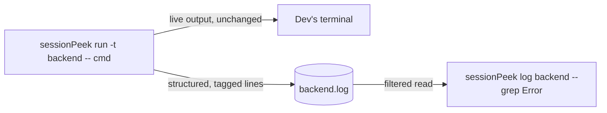

<p align="center">
  
</p>

<h1 align="center">sessionPeek</h1>
<p align="center"><i>Peek into your dev sessions — don't get stuck fighting over them.</i></p>

<p align="center">
  <a href="#installation">Installation</a> ·
  <a href="#quick-start">Quick start</a> ·
  <a href="#commands">Commands</a> ·
  <a href="#log-format">Log format</a> ·
  <a href="#configuration">Configuration</a> ·
  <a href="#agent-integration">Agent integration</a>
</p>

---

## The problem

You're running a dev server in one terminal. Your AI agent needs to know what it's doing — is it up, did it crash, what does that stack trace say. So either:

- you paste the terminal output into the chat every time something happens, or
- the agent runs the dev server itself, and now *it* owns the terminal your dev server needs, or
- the agent asks for the whole log and burns a few thousand tokens reading lines it didn't need.

None of that scales past a toy project, and it gets worse with multiple services (frontend, backend, db) all wanting the same thing.

## The idea

Tag the process once. Query it as many times as you want, filtered, from anywhere.

```
sessionPeek run -t backend -- python manage.py runserver
```

runs exactly like running the command directly — same terminal, same live output — while quietly writing a structured, timestamped log on the side. Later, from a completely different terminal (or an agent's tool call):

```
sessionPeek log backend --stderr-only --since 5m
```

pulls back only what matters. No pasting, no shared terminal, no token-dump.



sessionPeek doesn't care what `<command...>` is. Python, Node, Rust, a shell one-liner — it just wraps the process and classifies its output by stream (stdout/stderr), nothing stack-specific.

## Installation

```
git clone <this repo>
cd sessionPeak
cargo build --release
```

The binary is `target/release/sessionPeek`. Put it on your `PATH` (or `cargo install --path .`) to use it from any project.

## Quick start

```
# start a tagged process — behaves exactly like running the command directly
sessionPeek run -t backend -- python manage.py runserver

# from another terminal, or an agent's tool call:
sessionPeek log backend                        # everything
sessionPeek log backend --tail 20               # last 20 lines
sessionPeek log backend --stderr-only           # errors only
sessionPeek log backend --grep "500|Traceback"  # regex match
sessionPeek log backend --since 10m             # only recent lines

# restart clean instead of appending to old output
sessionPeek run -t backend --fresh -- python manage.py runserver

# done with a tag's history
sessionPeek delete backend
```

## Commands

| Command | Description |
|---|---|
| `run -t <tag> [--fresh] -- <command...>` | Runs `<command...>` in the foreground, tee'ing live output to your terminal while writing a structured log. `--fresh` truncates the tag's log first instead of appending. |
| `log <tag> [flags]` | Reads and filters `<tag>`'s log. See below. |
| `delete <tag>` | Deletes `<tag>`'s log file. |

`log` flags (composable):

| Flag | Effect |
|---|---|
| `--tail <N>` | last N matching lines |
| `--stdout-only` | stdout lines only |
| `--stderr-only` | stderr lines only |
| `--grep <pattern>` | regex match on line content |
| `--since <duration>` | only lines newer than this, e.g. `30s`, `10m`, `2h` |

`-h`/`--help` and `-V`/`--version` work at every level (`sessionPeek --help`, `sessionPeek run --help`, `sessionPeek log --help`).

> **Not implemented yet:** `-d`/`--detach` (background execution), `status`, `stop`. `run` currently blocks in the foreground — for now, background it the way you'd background anything else (`&`, `nohup`, your agent's own background-execution tool).

## Log format

Plain text, one line per entry:

```
[2026-09-13T12:29:48Z][stdout] test script started
[2026-09-13T12:29:57Z][stderr] ERROR: e error
```

Classification is by **stream** (stdout vs. stderr), not by parsing content for words like "error" — that's the one signal that's reliable regardless of what tool is producing the output.

Two things happen before a line reaches the log, aimed at making it hold up against real tools (not just clean scripts):

- **Robust line assembly** — a `\r`-driven progress bar or an `input()`-style prompt with no trailing newline won't get glued onto whatever prints next. A bare `\r` is treated as "this line is being overwritten," matching how a terminal actually displays it, and any content left dangling after a short idle gap gets flushed on its own rather than merged into later output.
- **ANSI stripped, log-side only** — color/cursor escape codes are removed from what's written to the log (so `--grep` and reading the file directly both just work), while your terminal still sees the tool's full raw, colored output.

## Configuration

sessionPeek doesn't require git, or any particular stack. Project root is found the way an editor finds it: walking up from your current directory looking for the nearest of `.sessionpeek.json`, `.git`, `Cargo.toml`, `package.json`, `pyproject.toml`, `go.mod`, and a handful of other common markers — falling back to your current directory if none exist.

Logs default to `<project-root>/.cache/sessionpeek/<tag>.log`. Override with a project config file:

```json
// .sessionpeek.json  (at your project root — also pins the root explicitly)
{
  "log_dir": "/somewhere/else"
}
```

or a global one at `~/.config/sessionPeek/config.json`, for a default that applies everywhere. Project config wins over global.

## Agent integration

[`skill/session-peek/SKILL.md`](skill/session-peek/SKILL.md) is a portable skill doc written for onboarding an AI agent to this tool — what to run, what flags exist, and when it's appropriate (or not) to wire sessionPeek into a project's own scripts (`package.json`, `Makefile`, etc.) versus leaving a pre-established, multi-contributor repo alone. Paste it into an agent's context, or drop the folder into `.claude/skills/`.

## Status

Early and actively evolving. `run`, `log`, and `delete` are implemented and tested against real interactive/streaming output, not just clean scripts. Detach mode and process lifecycle commands (`status`/`stop`) are the next planned piece.
